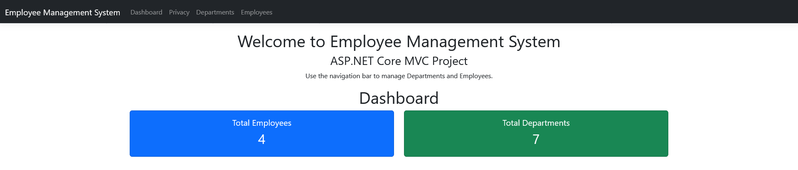

# Employee Management System

A web-based **Employee Management System** developed using **ASP.NET MVC 5**, **Entity Framework (Database First)**, and **SQL Server**. The application provides complete Employee and Department management with CRUD operations, responsive UI, and **PDF Report Generation**.

---

## Features

### Employee Management
- Add New Employee
- View Employee Details
- Update Employee Information
- Delete Employee

### Department Management
- Add Department
- View Department Details
- Update Department Information
- Delete Department

### PDF Report Generation
- Generate Employee Reports in PDF format
- Printable employee information
- Easy report sharing

### Database
- SQL Server Integration
- Entity Framework (Database First)
- Employee-Department Relationship

### User Interface
- Responsive Bootstrap Design
- Form Validation
- Clean and User-Friendly Interface

---

## Technologies Used

- ASP.NET MVC 5
- C#
- Entity Framework (Database First)
- SQL Server
- Bootstrap
- HTML5
- CSS3
- JavaScript
- Razor View Engine
- PDF Report Generation

---

## Project Structure

```
EmployeeManagementSystem
│
├── Controllers
├── Models
├── Views
├── Content
├── Scripts
├── App_Data
├── Web.config
└── EmployeeManagementSystem.sln
```

---

## Database Structure

### Employees

| Column |
|---------|
| EmployeeId |
| Name |
| Email |
| Mobile |
| Address |
| Gender |
| JoiningDate |
| DepartmentId |

### Departments

| Column |
|---------|
| DepartmentId |
| DepartmentName |
| ManagerName |

### Relationship

```
Department (1)
      │
      │
      ▼
Employees (Many)
```

---

## Screenshots

## Screenshots

### Dashboard

<p align="center">
  
</p>

---

### Department List

<p align="center">
  
</p>

---

### Employee List

<p align="center">
  
</p>

---

### PDF Report

<p align="center">
  
</p>

---

## How to Run

### 1. Clone Repository

```bash
git clone https://github.com/Arpit-tR/EmployeeManagementSystem.git
```

### 2. Open the Solution

Open the project in **Visual Studio 2022**.

```
EmployeeManagementSystem.sln
```

### 3. Restore NuGet Packages

```
Tools
→ NuGet Package Manager
→ Restore NuGet Packages
```

### 4. Configure Database

Update the connection string in:

```
Web.config
```

Point it to your SQL Server instance.

### 5. Build and Run

Press

```
F5
```

or

```
Ctrl + F5
```

---

## Key Highlights

- ASP.NET MVC Architecture
- Entity Framework (Database First)
- SQL Server Integration
- Employee & Department CRUD Operations
- Bootstrap Responsive UI
- Form Validation
- PDF Report Generation
- Clean Code Structure

---

## Future Enhancements

- Dashboard Analytics
- Employee Search
- RDLC Reports
- Crystal Reports
- Login & Authentication
- Role-Based Authorization
- Export to Excel
- Email Notifications

---

## Related Project

### Employee Management System with Dashboard & RDLC Reports

An enhanced version of this project featuring:

- Dashboard Analytics
- Employee Search
- RDLC Reports
- Improved UI
- Reporting Dashboard

Repository:

https://github.com/Arpit-tR/EmployeeManagementSystem_Reports

---

## Author

**Arpit Sadhukhan**

GitHub:
https://github.com/Arpit-tR

LinkedIn:
*(Add your LinkedIn profile here if available.)*

---

## License

This project is developed for learning, practice, and portfolio purposes.
